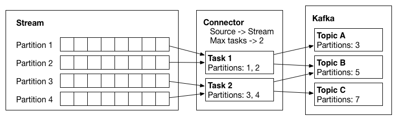

# Notes on Kafka Connectors

Paused work here: https://docs.confluent.io/platform/current/connect/devguide.html#connector-example

Notes take from items in the resources section below. Most ideas are not mine, and just notes to help me remember.

## Terminology

[Connectors](https://docs.confluent.io/platform/7.8/connect/javadocs/javadoc/org/apache/kafka/connect/connector/Connector.html)

* Connectors do not copy the data
* Connectors describe the set of data to be copied
* Connectors will break a job in to Tasks that are distributed to Kafka Connect Workers
* SourceConnectors: to import the data
* SinkConnectors: to export the data

[Task](https://docs.confluent.io/platform/7.8/connect/javadocs/javadoc/org/apache/kafka/connect/connector/Task.html)

* Contain the code that copies the data to/from a system
* SourceTask: import
* SinkTask: export

Partitioned Stream

* The data model that connectors MUST map all source and sink data to. 
* Similar format to that of a Kafka Topic
* Each partition is an ordered sequence of records with offsets

[Struct](https://docs.confluent.io/platform/7.8/connect/javadocs/javadoc/org/apache/kafka/connect/data/Struct.html) and [SchemaBuilder](https://docs.confluent.io/platform/7.8/connect/javadocs/javadoc/org/apache/kafka/connect/data/SchemaBuilder.html)

```java
Schema schema = SchemaBuilder.struct()
        .name("com.example.Person")
        .field("name", Schema.STRING_SCHEMA)
        .field("age", Schema.INT32_SCHEMA).build();
 Struct struct = new Struct(schema)
         .put("name", "Bobby McGee")
         .put("age", 21);
```

Here is an example of building a struct schema:
```java
Schema dateSchema = SchemaBuilder.struct()
   .name("com.example.CalendarDate").version(2).doc("A calendar date including month, day, and year.")
   .field("month", Schema.STRING_SCHEMA)
   .field("day", Schema.INT8_SCHEMA)
   .field("year", Schema.INT16_SCHEMA)
   .build();
```
Here is an example of using a second SchemaBuilder to construct complex, nested types:
```java
Schema userListSchema = SchemaBuilder.array(
   SchemaBuilder.struct()
           .name("com.example.User")
           .field("username", Schema.STRING_SCHEMA)
           .field("id", Schema.INT64_SCHEMA)
           .build()
).build();
```

[Converter](https://docs.confluent.io/platform/7.8/connect/javadocs/javadoc/org/apache/kafka/connect/storage/Converter.html)

* The Converter interface provides support for translating between Kafka Connect's runtime data format and byte[]. 
* Internally, this likely includes an intermediate step to the format used by the serialization layer (e.g. JsonNode, GenericRecord, Message).

## Flow

* Task will have an assignment of data to be copied in hand
* Each Task must copy a subset of the total data to/from Kafka
* Data the Connector copies must be represented as a `partitioned stream`
* Each task is assigned a subset of these partitions to be processed

Easy example

* Each file in a set of log files can be considered a partition
* Each line within the file is considered a record
* Offsets map to a line number in the file

More complex example

* JDBC tables map each table to a partition, but offset unclear
* One possible mapping uses a timestamp column to generate queries to incrementally return new data and last queried TS
  can be used as the offset.

Image below shows a source connector which has two tasks. Tasks copy data from input partitions and write records to
Kafka.


## Partitions and Records

* Both keys and value can be primitives, arrays, structs, Maps, Collections, etc.
* 

## Resources

* [Confluent Kafka Connect Dev Guide](https://docs.confluent.io/platform/current/connect/devguide.html)